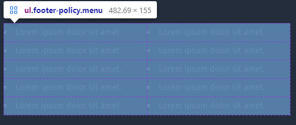

## CSS Grid





#### Sss Style

```css

    display: grid; 
    grid-template-columns: repeat(2, 1fr);  // 2 columns
    grid-template-rows: repeat(5, 1fr);     // 5 rows
    grid-auto-flow: column;


```

