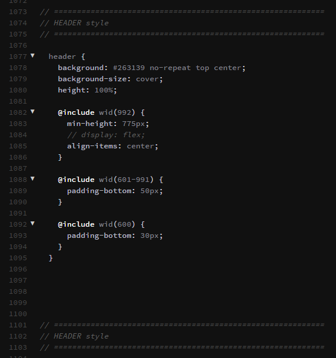

##  JavaScript isMobile

<!---->

#### JavaScript

```javascript


// делаете переменную в начале кода
var isMobile = false;
// проверка на размер экрана (размер я брал вроде с Bootstrap-а)
$(document).ready( function() {
    if ($('body').width() <= 400) {
        isMobile = true;
    }
    // и потом если нужен код только для телефона:
    if (isMobile) {
        ...
    }
    // или для остальных
    if (!isMobile) {
        ...
    }
} );
                   
                   
$(window).resize(function() {
    width = $(window).width();
    if (width >= 991) {
        //ваши скрипты
    }
});
      

```


 [$(window).resize](https://api.jquery.com/resize/)