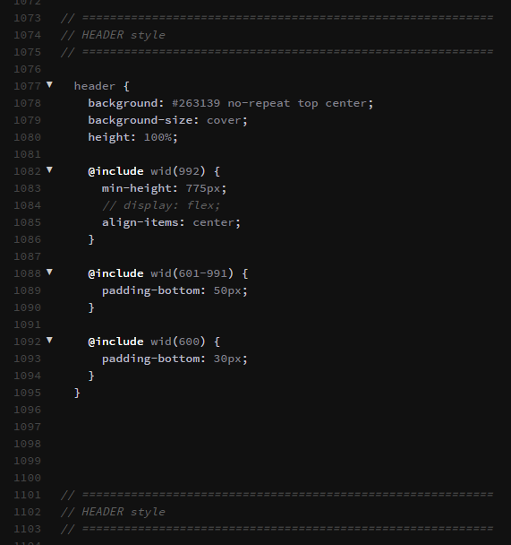

## WGET

<!---->

Clone site


#### Console

```html

wget --version

wget -mpHkKE --restrict-file-names=windows -t 1 -e robots=off -U 'Mozilla/5.0 (X11; Ubuntu;Linux x86_64; rv:40.0) Gecko/20100101 Firefox/40.0' https:// - Link


```

wget  [Links](https://eternallybored.org/misc/wget/)