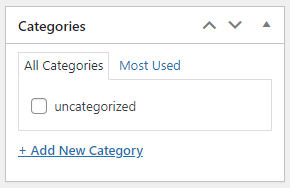

### PAGE




##### ADD IN PAGES PARAMETR Category


```php

  function myplugin_settings() {  
      // Add tag metabox to page
      register_taxonomy_for_object_type('post_tag', 'page'); 
      // Add category metabox to page
      register_taxonomy_for_object_type('category', 'page');  
  }
   // Add to the admin_init hook of your theme functions.php file 
  add_action( 'init', 'myplugin_settings' );


 ```

<!--#### In SCSS-->

<!--MD-MANUAL/scss/media/ [Links](https://github.com/Fobiya/MD-MANUAL/tree/master/scss/media)-->