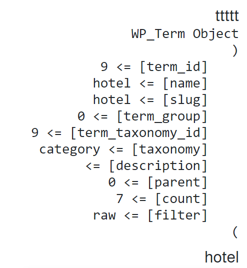

# Relationship

<!---->


```php

<?php
$featured_posts = get_field('featured_posts');
if( $featured_posts ): ?>
    <ul>
    <?php foreach( $featured_posts as $post ): 

        // Setup this post for WP functions (variable must be named $post).
        setup_postdata($post); ?>
        <li>
            <a href="<?php the_permalink(); ?>"><?php the_title(); ?></a>
            <span>A custom field from this post: <?php the_field( 'field_name' ); ?></span>
        </li>
    <?php endforeach; ?>
    </ul>
    <?php 
    // Reset the global post object so that the rest of the page works correctly.
    wp_reset_postdata(); ?>
<?php endif; ?>


```

```php

   

```


<!--#### In SCSS-->

advancedcustomfields relationship [Links](https://www.advancedcustomfields.com/resources/relationship/)

<!--MD-MANUAL/scss/media/ [Links](https://github.com/Fobiya/MD-MANUAL/tree/master/scss/media)-->