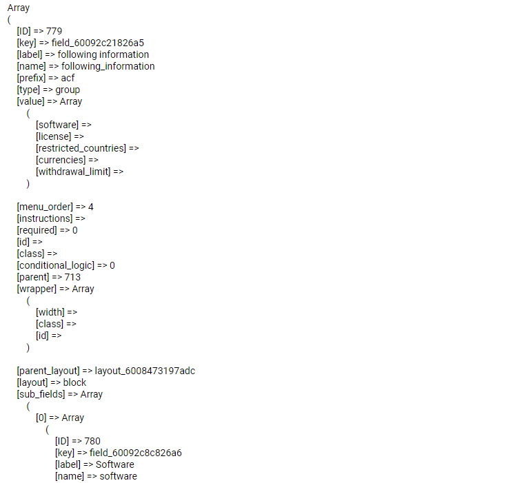

# get_field_object




```php

<?php  $field_60092c8c826a6 = get_sub_field_object('field_60092c8c826a6'); echo $field_60092c8c826a6['label']; ?>

```

```php

    <?php

        $field_key = "field_537b78c6c743f";
        $field = get_field_object($field_key);

        if($field) {
            echo "<pre>";
            print_r($field);
            echo "</pre>";
        }

    ?>


```


```php
   
    <?php

        $group_ID1 = 37;

        $fields = array($group_ID1);

        if ($fields1['active'] !== null) {
            echo "<h1>";
            echo $fields1['active']['text'];
            echo $fields1['title']['text'];
            echo $fields1['content']['text'];
            echo "<h1>";
        }

        $group_ID2 = 38;

        $fields2 = array($group_ID2);

        if ($fields2['active'] !== null) {
            echo "<h1>";
            echo $fields2['active']['text'];
            echo $fields2['title']['text'];
            echo $fields2['content']['text'];
            echo "<h1>";
        }

    ?>
    
```


```php
   

    <?php
        // Get wordpress page all fields
        $post_id = get_the_ID();
        $fields = get_field_objects($post_id);
    ?>

    <?php
        // Remember Widget
        $status = $fields['remember-status']['value'];
        $text = $fields['remember-text']['value'];
        if ($status == TRUE) {
            echo "<div class=\"info-container\">";
                echo "<p>" . $text . "</p>";
            echo "</div>";
        };
    ?>

```

<!--#### In SCSS-->

<!--MD-MANUAL/scss/media/ [Links](https://github.com/Fobiya/MD-MANUAL/tree/master/scss/media)-->