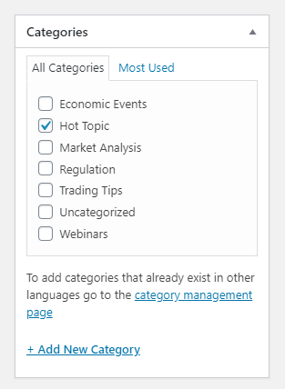

## Category




add file in you template ``category.php and single.pgp``

url ``domen/category/name-category/``

### single_cat_title

```php

echo  single_cat_title( '', false );


```

### wp_list_categories();

```php

    <ul class="list_icon">
      <?php
        wp_list_categories( array(
            'orderby'    => 'count',
            'order'      => 'DESC',
            'show_count' => 1,
            'title_li'   => '',
            'number'     => 10,
            'hide_empty' => true,
        ) );
        ?>
    </ul>
    
    
    
if( is_category( $category ) ){
	// code... you function - 
}
    

  if ( 'webinars' === get_query_var( 'post_type' ) ) {
      get_template_part( 'template-parts/content', 'search-webinars' );
  } elseif ('post' === get_query_var( 'post_type' )) {
      get_template_part( 'template-parts/content', 'search-vitals' );
  } else {
      get_template_part( 'template-parts/content', 'search-general' );
  }

    
is_category();
// When any Category archive page is being displayed.
 
is_category( '9' );
// When the archive page for Category 9 is being displayed.
 
is_category( 'Stinky Cheeses' );
// When the archive page for the Category with Name "Stinky Cheeses" is being displayed.
 
is_category( 'blue-cheese' );
// When the archive page for the Category with Category Slug "blue-cheese" is being displayed.
 
is_category( array( 9, 'blue-cheese', 'Stinky Cheeses' ) );
// Returns true when the category of posts being displayed is either term_ID 9,
// or slug "blue-cheese", or name "Stinky Cheeses".
    

```


### ADD IN PAGES PARAMETR Category


```php


    function myplugin_settings() {  
        // Add tag metabox to page
        register_taxonomy_for_object_type('post_tag', 'page'); 
        // Add category metabox to page
        register_taxonomy_for_object_type('category', 'page');  
    }
     // Add to the admin_init hook of your theme functions.php file 
    add_action( 'init', 'myplugin_settings' );
    
``` 


<!--#### In SCSS-->

<!--MD-MANUAL/scss/media/ [Links](https://github.com/Fobiya/MD-MANUAL/tree/master/scss/media)-->