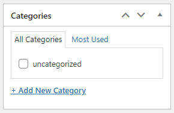

### Pagination

<!---->


##### Pagination page


```php


<?php

if( get_adjacent_post(false, '', true) ) { 
 previous_post_link('%link', '← Previous Post');
}
if( get_adjacent_post(false, '', false) ) { 
 next_post_link('%link', 'Next Post →');
}

next_post_link and previous_post_link


// 1 значение по умолчанию
$paged = get_query_var( 'paged' ) ? absint( get_query_var( 'paged' ) ) : 1;

$the_query = new WP_Query( array(
	'posts_per_page' => 5,
	'category_name'  => 'gallery',
	'paged'          => $paged,
) );

// цикл вывода полученных записей
while( $the_query->have_posts() ){
	$the_query->the_post();
	?>
	<!-- HTML каждой записи -->
	<?php
}
wp_reset_postdata();

// пагинация для произвольного запроса
$big = 999999999; // уникальное число

echo paginate_links( array(
	'base'    => str_replace( $big, '%#%', esc_url( get_pagenum_link( $big ) ) ),
	'current' => max( 1, get_query_var('paged') ),
	'total'   => $the_query->max_num_pages
) );
?>


// Запрашиваем продукты
$query = new WP_Query( [
	'post_type'      => 'product',
	'posts_per_page' => 5,
	'paged'          => get_query_var( 'page' ),
] );

// Обрабатываем полученные в запросе продукты, если они есть
if ( $query->have_posts() ) {

	while ( $query->have_posts() ) {
		$query->the_post();

		// выводим заголовок
		the_title();
	}

	wp_reset_postdata();
}

// Выводим пагинацию, если продуктов больше запрошенного количество
echo paginate_links( [
	'base'    => user_trailingslashit( wp_normalize_path( get_permalink() .'/%#%/' ) ),
	'current' => max( 1, get_query_var( 'page' ) ),
	'total'   => $query->max_num_pages,
] );


 ```
 
 

```php

          <?php  

          if ( isset( $_GET['number'] ) ) {
              $pagesnamber = (int) $_GET['number'];
          }else{
               $pagesnamber = (int) $_GET['number'];                   
          }

          echo $pagesnamber;


        $paged = ( get_query_var( 'paged' ) ) ? get_query_var( 'paged' ) : $pagesnamber;

        $args = array(

            'post_type'     => 'post',
            'posts_per_page' => 2,
            'paged'         => $paged,
        //    'orderby'       => 'date',
        );

        $loop = new WP_Query( $args );

        if ($loop->have_posts()) :
            while ($loop->have_posts()) : $loop->the_post(); ?>

                  <div class="col post-item">
                      <div class="col-inner">
                          <a href="<?= get_the_permalink(); ?>" class="plain">
                              <div class="box box-vertical box-text-bottom box-blog-post has-hover">
                                  <div class="box-image" style="width:40%;">
                                      <div class="image-cover" style="padding-top:56%;"> 
                                        " class="attachment-medium size-medium wp-post-image lazyload">

                                      </div>
                                  </div>
                                  <div class="box-text text-center">
                                      <div class="box-text-inner blog-post-inner">
                                          <h5 class="post-title is-large "><?= get_the_title(); ?></h5>
                                          <div class="is-divider"></div>

                                         <?php if( have_rows('header') ): ?>
                                          <?php while( have_rows('header') ): the_row(); 

                                              // Get sub field values.
                                            //  $title = get_sub_field('title');
                                              $sub_title = get_sub_field('sub_title');
                                              $link = get_sub_field('link'); ?>

                                              <?php if( get_sub_field('sub_title')): ?><!-- if under__the -->
                                                <p class="from_the_blog_excerpt "><?php the_sub_field('sub_title'); ?></p>
                                              <?php endif; ?>

                                          <?php endwhile; ?>
                                        <?php endif; ?>  


                                      </div>
                                  </div>
                                  <div class="badge absolute top post-date badge-outline">
                                      <div class="badge-inner"> <span class="post-date-day"><?= get_the_date('d'); ?></span>
                                          <br> <span class="post-date-month is-xsmall"><?= get_the_date('F'); ?></span></div>
                                  </div>
                              </div>
                          </a>
                      </div>
                  </div>               

            <?php endwhile;

            echo "<ul class=\"page-numbers nav-pagination links text-center\">";
            $big = 999999999; // need an unlikely integer
              echo paginate_links( array(
                  'format' => '?number=%#%',
                  'current' => $paged,
                  'total' => $loop->max_num_pages,
                  'prev_text'    => __('«'),
                  'next_text'    => __('»'),
                  'type' => 'list'
              ) );
            echo "</ul>";
        endif;

        wp_reset_query();  ?>
                        
                        

 ```             

<!--#### In SCSS-->

paginate_links/ [Links](https://wp-kama.ru/function/paginate_links)