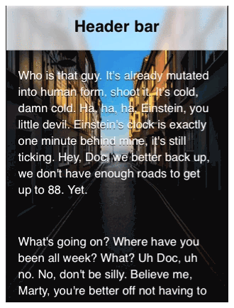

## backdrop-filter



#### Css Style

```css


.header {
    background-color: rgba(255,255,255,.6);
    backdrop-filter: blur(5px)
}


.text {
    background: rgba(0,0,0,.6);
    backdrop-filter: grayscale(1) contrast(3) blur(1px);
}


.element {
    background: filter(url(path/to/img.jpg), blur(5px));
}


```

#### In SCSS

Links

https://codepen.io/fobiya/pen/OJRYPbb

https://habr.com/ru/post/264037/
https://developer.mozilla.org/ru/docs/Web/CSS/backdrop-filter

https://codepen.io/fobiya/pen/oNzbaLK [Links](https://codepen.io/fobiya/pen/oNzbaLK)