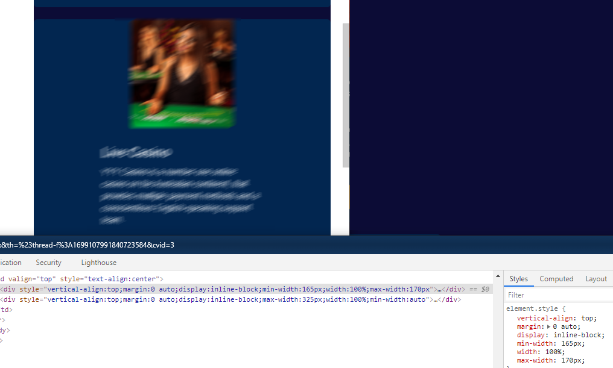

## CSS 2 Display block



#### Css Style

```css

.box__{
  display:block; 
  position: relative;
  width: 100%;
}
.box__ .left{
    text-align: left;
  display: inline-block;
  vertical-align: top;
  margin: 0 auto;
}
.box__ .right{
  text-align: right;
  display: inline-block;
  vertical-align: top;
  margin: 0 auto;
}


```

#### Html Structure


```html

<div class="box__">
   <div class="left">
       <p>Lorem ipsum dolor sit amet, consectetur adipisicing elit. Dolore, delectus, praesentium. Sunt rerum laboriosam quos numquam quaerat adipisci ipsum ullam.</p>
   </div>
  <div class="right">
       <p>Lorem ipsum dolor sit amet, consectetur adipisicing elit. Dolore, delectus, praesentium. Sunt rerum laboriosam quos numquam quaerat adipisci ipsum ullam.</p>
  </div>
</div>

```
