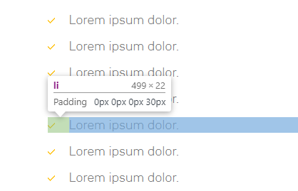

## Css Gradient



#### Css Style

```css
      
    background-image: linear-gradient(36deg, #7bc5ac 15%, #faffb1 95%);
    box-shadow: 0px 8px 21px 0px rgb(73 83 93 / 30%);

    background: radial-gradient(161.62% 280.89% at 86.61% 0,#feda75 0,#fa7e1e 25.52%,#d62976 48.44%,#962fbf 66.67%,#4f5bd5 100%);
```


