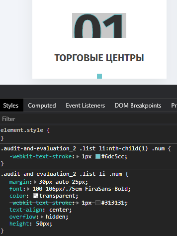

## input checkbox radio



#### Css Style

```css


  input[type='checkbox'],label,
    input[type='radio']{

      transition: all .1s ease;
      cursor: pointer;
      color: #003E52;

      font: 400 16px/1.2em  'Apercu Pro';
      span{
        font: 700 16px/1.2em  'Apercu Pro'; 
        margin-right: 5px;
      }


  }   

  input[type='checkbox']:checked + label,
  input[type='checkbox']:not(:checked) + label,
  input[type='radio']:checked + label,
  input[type='radio']:not(:checked) + label {

      max-height: 20px;

      display: flex;
      align-items: center;


      &:before{

            transition: all .3s ease !important;
          content: '';
          display: block;

          background: #fff;

          width: 20px;
          height: 20px;
          border-radius: 50%;
          transition: all 3s ease;

          border: 1px solid #003E52;

          margin: 0 auto 0 0;
          background: #fff no-repeat center;

          margin-right: 19px;

          @media screen and (max-width: 991px) and (min-width: 601px){
                 margin-right: 13px;
          }

          @media screen and (max-width: 600px){
                   margin-right: 11px;  

          }

      }
  }

  input[type='checkbox']:checked  + label ,
  input[type='radio']:checked + label {

      max-height: 20px;

      display: flex;
      align-items: center;


      &:before{
        content: '';
        display: block;


        width: 20px;
        height: 20px;
        border-radius: 50%;
         background: #50B78D;

         border: 1px solid #003E52;

        box-shadow: inset 0 0 0 2px #fff;

         margin: 0 0 0 auto;
                        transition: all .3s ease !important;


         background-repeat:no-repeat;
        background-position: center;

               margin-right: 19px;

        @media screen and (max-width: 991px) and (min-width: 601px){
               margin-right: 13px;
        }

        @media screen and (max-width: 600px){
                 margin-right: 11px;  

        }

      }
  }

  input{
    position: absolute;
    opacity: 0;
  }

  label{
    display: flex;
     white-space:nowrap;

    span{
      display: flex;
      white-space:nowrap;
    }
  }


  input[type="namber"]{
    opacity: 1;
    position: relative;

    max-width: 243px;
    width: 100%;

    padding: 15px 13px;

    max-height: 46px;

    background: #FFFFFF;
    border: 1px solid #D9D9D9;
    border-radius: 5px;

    outline: none;

    @media screen and (max-width: 600px){
       max-width: 100%;
    }


  }

```
