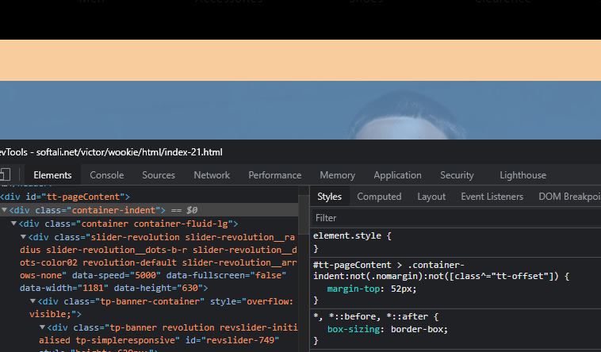
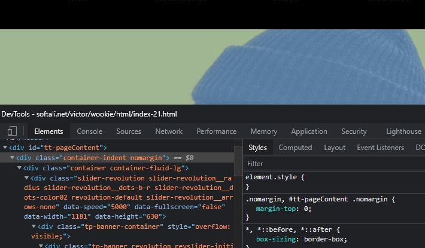

## List Style



#### Css Style

```html

<div class="container-indent">

```

```css

#tt-pageContent > .container-indent0:not(.nomargin):not([class^="tt-offset"]) {
  margin-top: 32px; }
  @media (max-width: 1024px) {
    #tt-pageContent > .container-indent0:not(.nomargin):not([class^="tt-offset"]) {
      margin-top: 43px; } }
  @media (max-width: 575px) {
    #tt-pageContent > .container-indent0:not(.nomargin):not([class^="tt-offset"]) {
      margin-top: 33px; } }

```




#### Css Style


```html

<div class="container-indent nomargin">

```


```css

#tt-pageContent > .container-indent0:not(.nomargin):not([class^="tt-offset"]) {
  margin-top: 32px; }
  @media (max-width: 1024px) {
    #tt-pageContent > .container-indent0:not(.nomargin):not([class^="tt-offset"]) {
      margin-top: 43px; } }
  @media (max-width: 575px) {
    #tt-pageContent > .container-indent0:not(.nomargin):not([class^="tt-offset"]) {
      margin-top: 33px; } }


```


