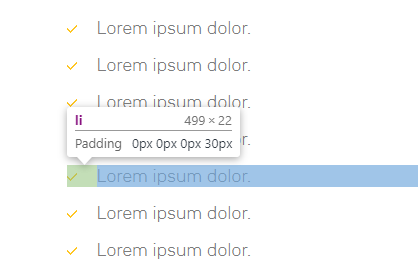

## List Style



#### Css Style

```css
ul.list {
    position: relative
}

ul.list li {
    padding-left: 30px
}

ul.list li p {
    color: #7d7d7d;
}

ul.list li:before {
    margin-top: 8px;
    width: 10px;
    height: 8px;
    background: url(data:image/png;base64,iVBORw0KGgoAAAANSUhEUgAAAAoAAAAIAgMAAAC9lIYlAAAABGdBTUEAALGPC/xhBQAAACBjSFJNAAB6JgAAgIQAAPoAAACA6AAAdTAAAOpgAAA6mAAAF3CculE8AAAADFBMVEX/xSf/xSf/xSf////39uGQAAAAAnRSTlMA/iyWEiMAAAABYktHRAMRDEzyAAAAKElEQVQI12NgYFBgYGBYwMDA2MDgwMrAkCDCwKAxgYGBq4GBgYmBAQA0bAM/erXIRAAAACV0RVh0ZGF0ZTpjcmVhdGUAMjAyMC0wNS0wNlQxMToxMTowMyswMDowMD66FDwAAAAldEVYdGRhdGU6bW9kaWZ5ADIwMjAtMDUtMDZUMTE6MTE6MDMrMDA6MDBP56yAAAAAAElFTkSuQmCCQg==) no-repeat top;
    position: absolute;
    left: 0
}
```

#### Html Structure


```html

<ul class='list'>
  <li><p>Lorem ipsum dolor.</p></li>
  <li><p>Lorem ipsum dolor.</p></li>
  <li><p>Lorem ipsum dolor.</p></li>
  <li><p>Lorem ipsum dolor.</p></li>
</ul>

```