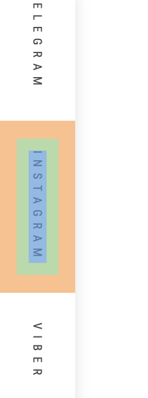

## List Style



#### Css Style

```css


.lvb-social {
    white-space: nowrap;
}

.lvb-social ul {
    display: flex;
    flex-direction: column;
    margin: 0;
    padding: 0;
    height: 100vh;
    justify-content: center;
    overflow-y: auto;
}
.lvb-social a{
    vertical-align: middle;
    margin: 15px 14px;
    padding: 10px;
    text-transform: uppercase;
    font-size: 10px;
    font-weight: 400;
    letter-spacing: 5px;
    -webkit-transition: color 300ms ease;
    -moz-transition: color 300ms ease;
    -o-transition: color 300ms ease;
    transition: color 300ms ease;
    display: inline-block;
    color: #5d5d5d;
    writing-mode: vertical-lr;
    transform: rotate(180deg) translateZ(0);
}

```


```html

<div class="lvb-social font_two">
	<ul id="menu-sotsial" class="menu">
		<li id="menu-item-6158" class="menu-item menu-item-type-custom menu-item-object-custom menu-item-6158">
			<a href="#">Youtube</a>
		</li>
		<li id="menu-item-4048" class="menu-item menu-item-type-custom menu-item-object-custom menu-item-4048">
			<a href="#">Telegram</a>
		</li>
		<li id="menu-item-4047" class="menu-item menu-item-type-custom menu-item-object-custom menu-item-4047">
			<a href="#">Instagram</a>
		</li>
		<li id="menu-item-6157" class="menu-item menu-item-type-custom menu-item-object-custom menu-item-6157">
			<a href="#">Viber</a>
		</li>
		<li id="menu-item-6159" class="menu-item menu-item-type-custom menu-item-object-custom menu-item-6159">
			<a href="#">Facebook</a>
		</li>
  </ul>
</div>

```
