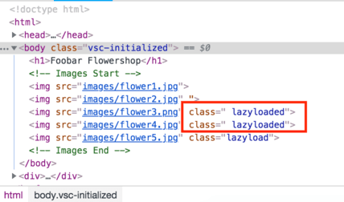

## lazyload



https://developers.google.com/speed/pagespeed/insights/?hl=ru

https://web.dev/codelab-use-lazysizes-to-lazyload-images/

https://cdnjs.com/libraries/lazysizes

```html

  
	
```

```html
       
    // Используйте леневую загрузку устаноиви ее в data-lazy атрибудет
    // В нем укажите источник к файлу в место SRC

    

    $('.lazy').slick({
      lazyLoad: 'ondemand',
      slidesToShow: 3,
      slidesToScroll: 1
    });
        

```

#### link

codelab-use-lazysizes-to-lazyload-images [Links](https://web.dev/codelab-use-lazysizes-to-lazyload-images/)


